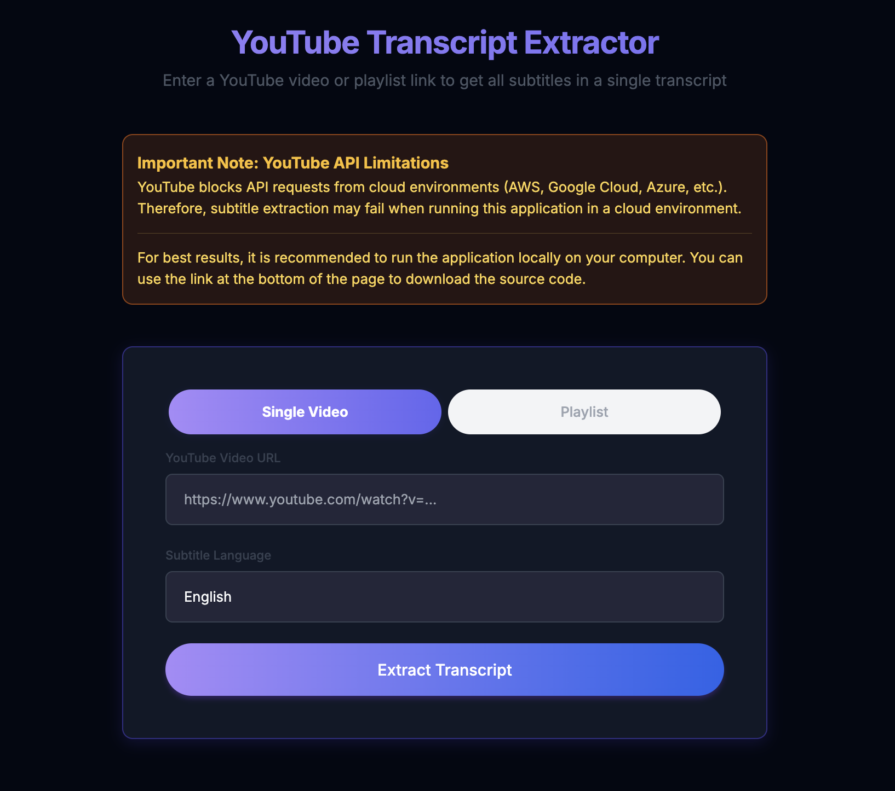

# YouTube Transcript Extractor

A modern web application to extract subtitles (transcripts) from YouTube videos or playlists, supporting multiple languages and both light/dark mode.



## Features

- Extract subtitles from a single YouTube video or an entire playlist
- Language selection (English, Turkish, German, French, Spanish)
- Automatic fallback to available languages if the selected one is not found
- Copy or download the extracted transcript
- Summary statistics (total videos, successful, fallback, failed)
- Responsive, accessible, and visually appealing UI
- Light and dark mode with instant theme switching

## Important Note: YouTube API Limitations

**YouTube blocks API requests from cloud environments (AWS, Google Cloud, Azure, etc.).**

Subtitle extraction may fail if you run this application on a cloud server due to YouTube's IP restrictions. For best results, run the application locally on your own computer.

For advanced proxy solutions, see `proxy_integration_doc.md`.

## Installation

### Local Installation

1. Clone the repository:
```sh
git clone https://github.com/yourusername/youtube-transcript-extractor.git
cd youtube-transcript-extractor
```

2. Create a virtual environment and install dependencies:
```sh
python -m venv venv
source venv/bin/activate  # On Windows: venv\Scripts\activate
pip install -r requirements.txt
```

3. Run the application:
```sh
python src/main.py
```

4. Open your browser and go to `http://localhost:5001`

## Usage

1. Paste a YouTube video or playlist URL into the input field
2. Select the desired subtitle language
3. Click the "Extract Transcript" button
4. When the process is complete, you can copy or download the transcript

## Technical Details

- Built with Flask (Python web framework)
- Uses `youtube-transcript-api` for subtitle extraction
- Responsive UI with Bootstrap 5 and custom CSS
- Supports both single video and playlist extraction
- Dark/light mode with animated toggle

## License

This project is licensed under the MIT License.
